# LifeBalance Mobile

Mobile-first Expo / React Native app for LifeBalance, a personal automation dashboard for rest mode, tasks, notes, office mode, driving safety, app muting, exercise, SOS, and expenses.

## Screenshots

App screenshots are included in [`docs/screenshots`](docs/screenshots).

<p>
  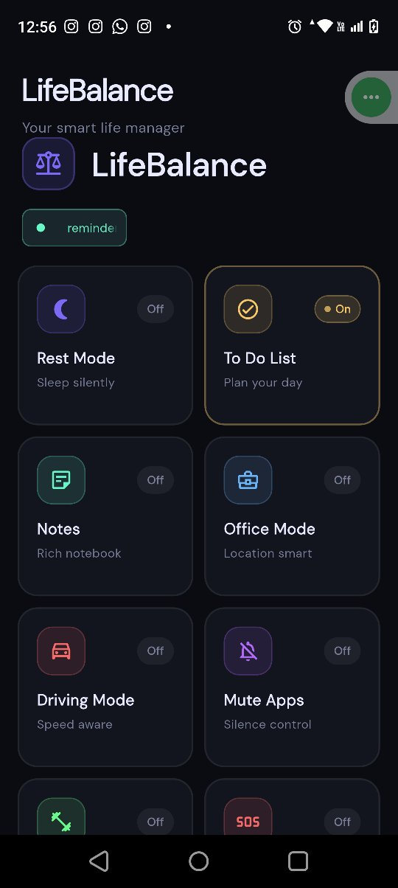
  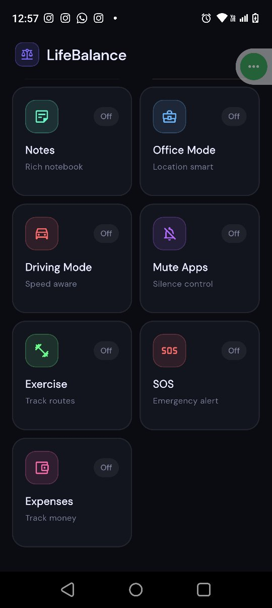
  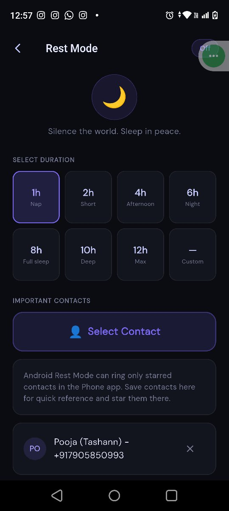
</p>

<p>
  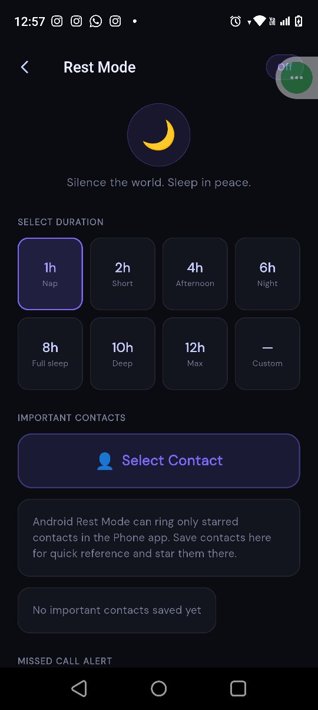
  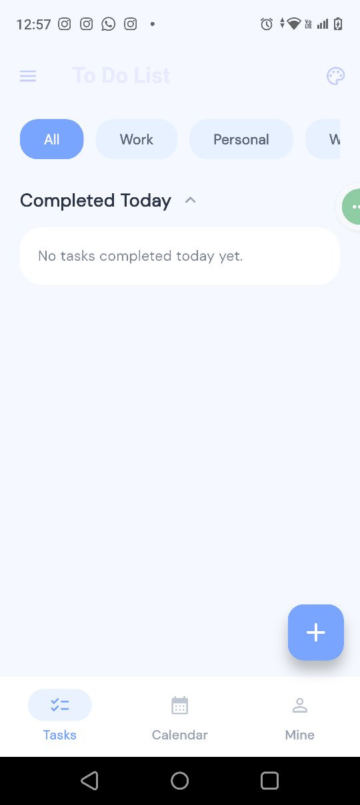
  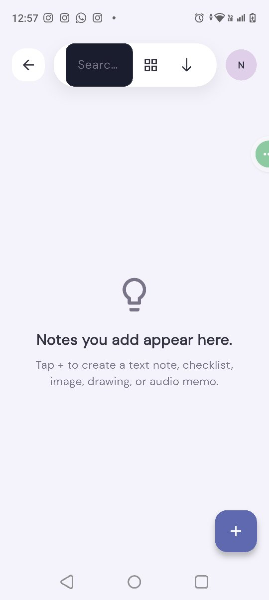
</p>

<p>
  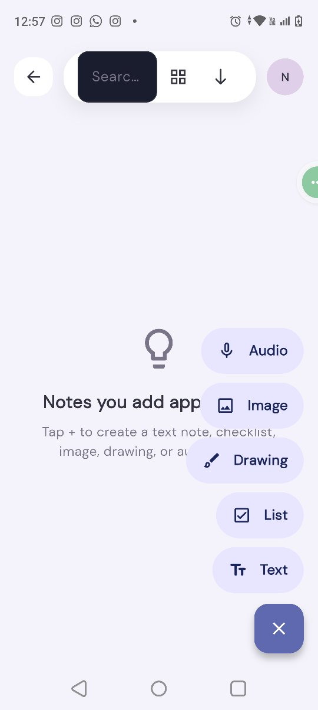
  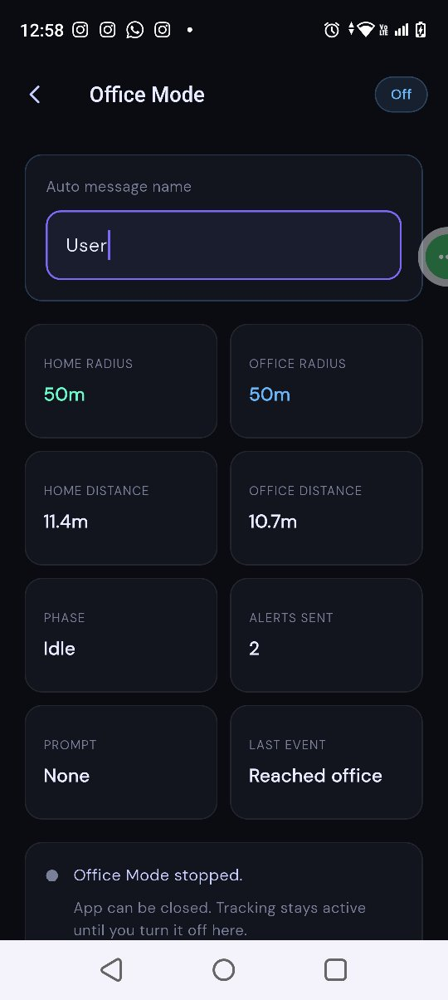
  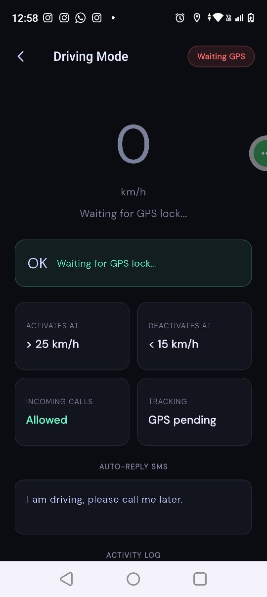
</p>

<p>
  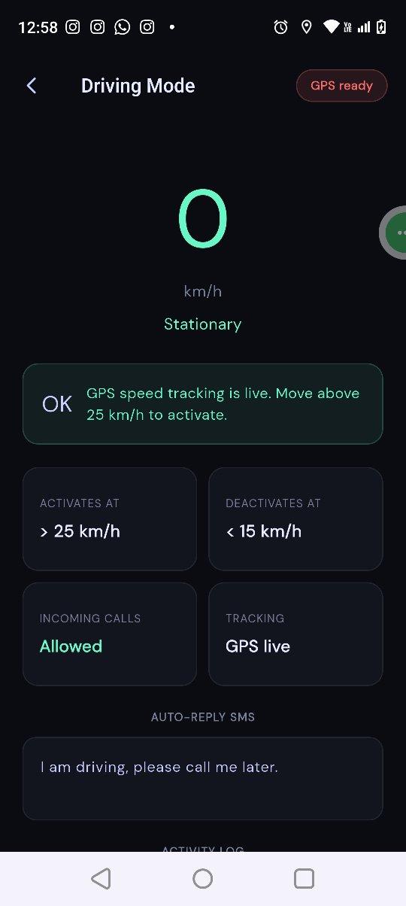
  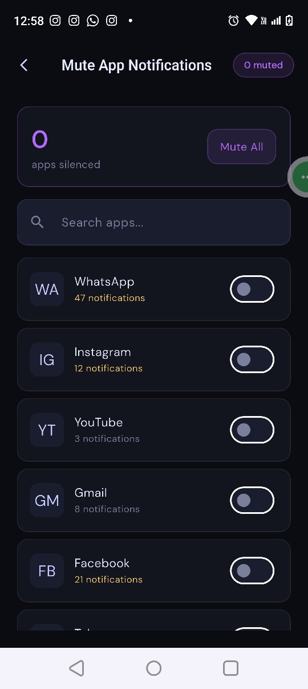
  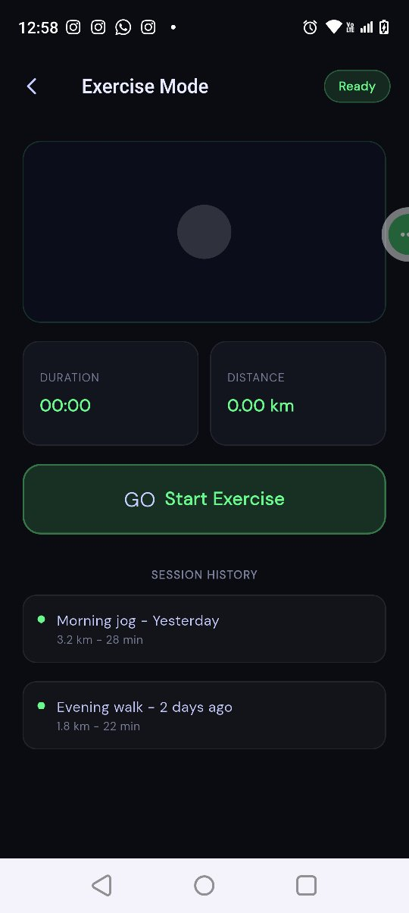
</p>

<p>
  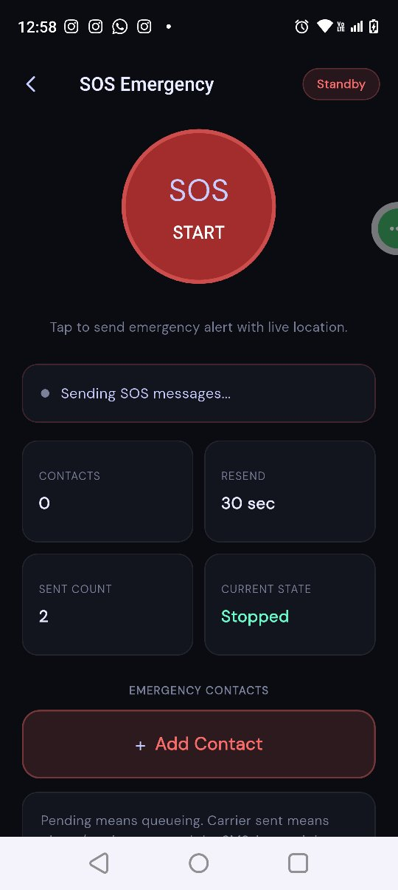
  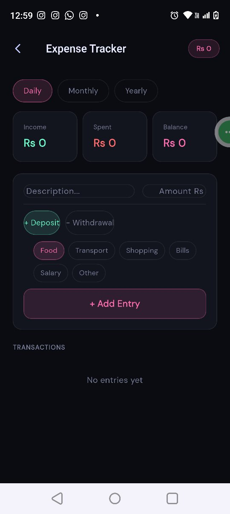
</p>

## Run

```bash
npm install
npm start
```

Or with Expo:

```bash
npx expo start
```

## Included

- Dark LifeBalance dashboard with mode cards and status pills
- Rest Mode with duration selection, important contacts, and call handling state
- To Do List and Keep-style notes with media/list options
- Office Mode with location-aware status and auto-message configuration
- Driving Mode with GPS speed state and auto-reply messaging
- Mute App Notifications screen with app search and toggles
- Exercise Mode with GPS session state and history
- SOS Emergency flow with emergency contacts and resend timing
- Expense Tracker with daily/monthly/yearly filters and entry form

## Android Native Features

The Android project includes native modules for device-specific behavior such as notification listener access, call screening, direct SMS, installed app lookup, reminder scheduling, file picking, and voice recording support.
